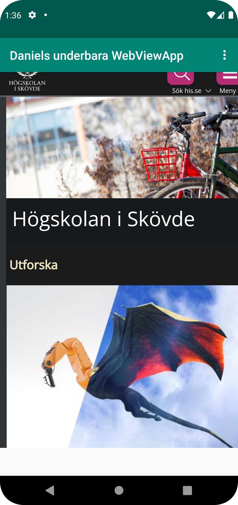
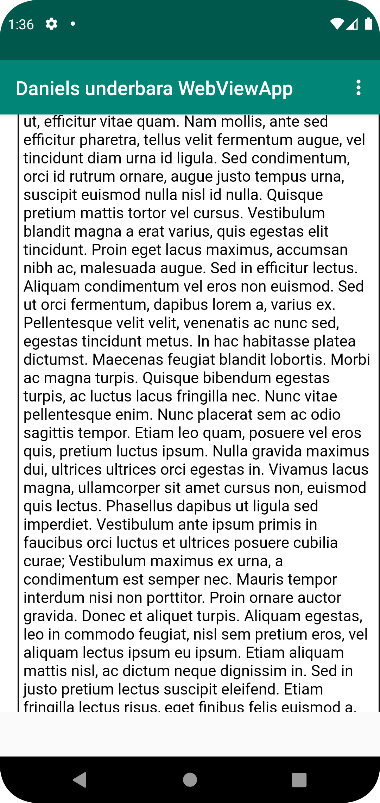

# Rapport

Inlämmning 2, WebView.

Jag började med att forka och klona projektet från github. Sedan ändrade jag namnen på appen genom att ändra värdet i strings.xml. Se kodexempel 1.

Jag gör så att appen tillåts att använda sig av internet. Se kodexempel 2.

Sedan ändrar jag i activity_main.xml för att få WebView istället för TextView. WebView får sedan ett id.  Se kodexempel 3.

Jag skapade en privat variabel vid namn myWebView som initieras vid appens start. Här hämtas även id. Se kodexempel 4

Sedan skapar jag en ny WebViewClient där  WebView läggs in. Se kodexempel 5

Jag måste sedan möjliggöra användandet av JavaScript, detta görs genom att hämta WebSettings för att configurera inställningar för 
webview, sedan sätter jag värdet true på JavaScriptEnabled för att göra så att WebView kan använda sig av JavaScript. Se kodexempel 6

Genom att implementera ShowExternalWebPage i if satsen längst ner i Mainctivity.java, detta görs även för ShowInternalWebPage. Här läggs respektive URL in i if-satsen för att hämra till appen. Se kodexempel 7


```
--------------------------------------------------------------
kodexempel 1 ändring av namn.
<string name="app_name">Daniels underbara WebViewApp</string>
--------------------------------------------------------------
--------------------------------------------------------------
kodexempel 2 tillåtelse av internet.
<uses-permission android:name="android.permission.INTERNET"/>
--------------------------------------------------------------
--------------------------------------------------------------
kodexempel 3 skapandet av WebView
 <WebView
        android:id="@+id/my_webview"
        android:layout_width="409dp"
        android:layout_height="673dp"
        tools:layout_editor_absoluteX="2dp"
        tools:layout_editor_absoluteY="56dp" />
--------------------------------------------------------------
--------------------------------------------------------------
kodexempel 4 skapandet av variabel.
myWebView=findViewById(R.id.my_webview);
--------------------------------------------------------------
--------------------------------------------------------------
kodexempel 5 WebViewClient
myWebView.setWebViewClient(new WebViewClient());
--------------------------------------------------------------
--------------------------------------------------------------
kodexempel 6 enablar JavaScript.
myWebView.getSettings().setJavaScriptEnabled(true);
--------------------------------------------------------------
--------------------------------------------------------------
kodexempel 7 implemenation av internal och external webpage.
if (id == R.id.action_external_web) {
            Log.d("==>","Will display external web page");
            myWebView.loadUrl("https://www.his.se/");
            showExternalWebPage();
            return true;
        }

        if (id == R.id.action_internal_web) {
            Log.d("==>","Will display internal web page");
            myWebView.loadUrl("file:///android_asset/about.html");
            showInternalWebPage();
            return true;
        }
--------------------------------------------------------------

```

Bilder läggs i samma mapp som markdown-filen.



